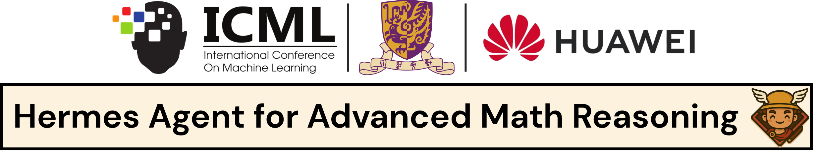
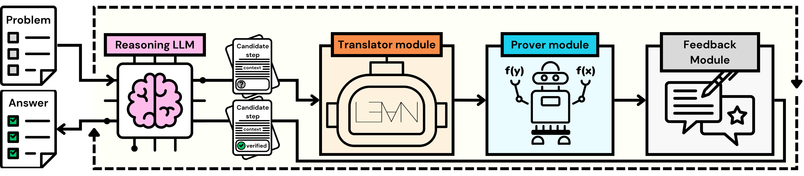
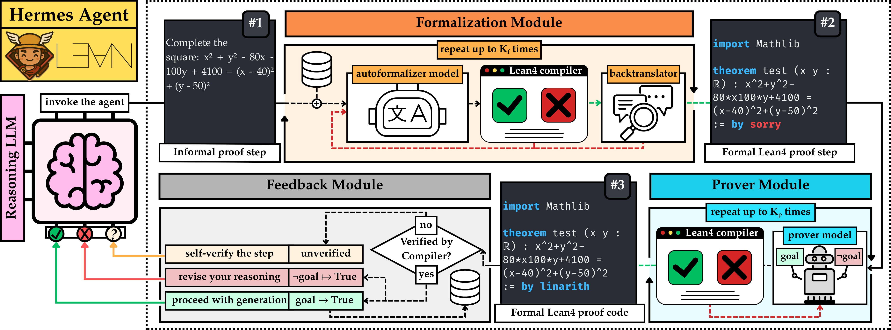

# [ICML 2026] HERMES Agent



Azim Ospanov <sup>1,</sup><sup>2</sup>, Zijin Feng <sup>1</sup>, Jiacheng Sun <sup>1</sup>, Haoli Bai <sup>1</sup>, Xin Shen <sup>3</sup>, Farzan Farnia <sup>2</sup>


<sup>1</sup> <sub>**Huawei Foundation Model Department**, </sub> <sup>2</sup> <sub>**The Chinese University of Hong Kong**, </sub> <sup>3</sup> <sub>**Celia Team**</sub>

## Overview
This repository accompanies ["HERMES: Towards Efficient and Verifiable Mathematical Reasoning in LLMs"](https://arxiv.org/abs/2511.18760) work published at ICML 2026. The codebase contains the agent implemented with LangChain and additional documentation on how to set it up with Lean4. The high-level overview of the method is below:



Hermes is a **single-step formal verifier** designed to be plugged into a general-purpose
LLM agent (e.g. via [LangGraph](https://github.com/langchain-ai/langgraph)). It exposes one
tool — `verify_one_mathematical_step` — that takes an English-language proof step, autoformalizes
it into Lean 4, attempts a formal proof, and returns one of three labels back to the agent:

| Label | Meaning |
|---|---|
| `**CORRECT**` | The step was successfully proven in Lean 4. |
| `**INCORRECT**` | Lean 4 proved the *negation* of the step (i.e. the agent hallucinated). |
| `**VERIFICATION FAILURE**` | Lean 4 was unable to prove or disprove the step (inconclusive). |

The goal is to let any base model "tool-call" Hermes whenever it is about to make a non-trivial
mathematical claim, so hallucinated arithmetic and algebra can be caught before they propagate
through the rest of the reasoning trace.

## Evaluation Results

Accuracy (%) of different reasoning models under four inference strategies: zero-shot CoT (@1), majority vote (@5), reward-model selection (Best-of-5), and **HERMES** (@1 and @5). Results are reported on four benchmarks: MATH500 (MATH), AIME'25 (AIME), CollegeMath (CM), and HARDMath2 (HM2). The best and second-best results are **bolded** and <ins>underlined</ins>, respectively.

<table>
  <tr>
    <th rowspan="2">Method</th>
    <th colspan="4">Qwen3-8B</th>
    <th colspan="4">OpenAI o3-mini</th>
    <th colspan="4">DeepSeek-V3.2</th>
  </tr>
  <tr>
    <th>MATH</th><th>AIME</th><th>CM</th><th>HM2</th>
    <th>MATH</th><th>AIME</th><th>CM</th><th>HM2</th>
    <th>MATH</th><th>AIME</th><th>CM</th><th>HM2</th>
  </tr>
  <tr>
    <td>CoT@1</td>
    <td>84.8</td><td>20.0</td><td>69.1</td><td>4.3</td>
    <td>95.8</td><td>63.3</td><td>75.2</td><td>23.2</td>
    <td>95.8</td><td>50.0</td><td>79.8</td><td>25.6</td>
  </tr>
  <tr>
    <td>CoT@5+Majority</td>
    <td>87.0</td><td>16.7</td><td>70.3</td><td>4.7</td>
    <td>96.8</td><td>70.0</td><td>76.0</td><td>22.7</td>
    <td>97.6</td><td>60.0</td><td>80.8</td><td>26.1</td>
  </tr>
  <tr>
    <td>CoT@5+Skywork</td>
    <td>91.0</td><td>30.0</td><td>72.0</td><td>5.7</td>
    <td>96.8</td><td><ins>83.3</ins></td><td>76.1</td><td>29.4</td>
    <td>97.4</td><td>53.3</td><td>80.4</td><td>30.8</td>
  </tr>
  <tr>
    <td>CoT@5+ArmoRM</td>
    <td>88.6</td><td>30.0</td><td>72.4</td><td>5.2</td>
    <td>96.2</td><td>76.7</td><td>76.1</td><td>28.4</td>
    <td>97.2</td><td>53.3</td><td>80.3</td><td>28.4</td>
  </tr>
  <tr>
    <td>CoT@5+Shepherd</td>
    <td>87.8</td><td>23.3</td><td>70.2</td><td>5.7</td>
    <td>96.4</td><td>80.0</td><td>75.7</td><td>25.6</td>
    <td>97.0</td><td>60.0</td><td>80.4</td><td>27.8</td>
  </tr>
  <tr>
    <td>CoT@5+RLHFlow</td>
    <td>84.0</td><td>20.0</td><td>69.4</td><td>5.7</td>
    <td>95.8</td><td>70.0</td><td>75.9</td><td>28.4</td>
    <td>97.2</td><td>60.0</td><td>80.3</td><td>24.6</td>
  </tr>
  <tr>
    <th colspan="13" align="left"><i>Lean-based methods</i></th>
  </tr>
  <tr>
    <td>CoT@5+Safe</td>
    <td>89.4</td><td>23.3</td><td>72.4</td><td>5.7</td>
    <td>96.0</td><td><ins>83.3</ins></td><td>75.7</td><td>26.1</td>
    <td>96.2</td><td>56.7</td><td>80.0</td><td>28.9</td>
  </tr>
  <tr>
    <td>CoT@5+Safe*</td>
    <td>89.4</td><td>23.3</td><td>72.5</td><td>6.2</td>
    <td>96.8</td><td><ins>83.3</ins></td><td>75.8</td><td>25.6</td>
    <td>96.6</td><td>60.0</td><td>80.1</td><td>30.3</td>
  </tr>
  <tr>
    <td><b>HERMES</b> <i>@1</i></td>
    <td>91.2</td><td>30.0</td><td>73.0</td><td>6.6</td>
    <td><b>97.2</b></td><td><b>86.7</b></td><td>78.9</td><td><ins>31.3</ins></td>
    <td><ins>98.4</ins></td><td>70.0</td><td>83.3</td><td>33.6</td>
  </tr>
  <tr>
    <td><b>HERMES</b>@5 <i>+Majority</i></td>
    <td><ins>93.0</ins></td><td><ins>33.3</ins></td><td><ins>75.8</ins></td><td><ins>7.6</ins></td>
    <td><ins>97.0</ins></td><td><b>86.7</b></td><td><b>79.4</b></td><td><b>31.8</b></td>
    <td><b>98.6</b></td><td><ins>76.7</ins></td><td><b>85.2</b></td><td><ins>35.1</ins></td>
  </tr>
  <tr>
    <td><b>HERMES</b>@5 <i>+Skywork</i></td>
    <td><b>94.6</b></td><td><b>43.3</b></td><td><b>77.4</b></td><td><b>10.0</b></td>
    <td><ins>97.0</ins></td><td><b>86.7</b></td><td><ins>79.2</ins></td><td><ins>31.3</ins></td>
    <td>98.2</td><td><b>80.0</b></td><td><ins>84.0</ins></td><td><b>36.5</b></td>
  </tr>
</table>

> **Note on reward-model integration.** This repository ships only the Hermes verifier
> and agent loop. The reward-model rows above (`+Skywork`, `+ArmoRM`, `+Shepherd`,
> `+RLHFlow`, etc.) score Hermes-generated CoT traces with an *external* reward model,
> which is a separate pipeline that is **not** included here. To reproduce those numbers,
> generate `@5` CoT samples with Hermes and then score / select among them following the
> instructions in each reward model's own documentation

## Full Hermes Agent Framework 



Optionally, Hermes also keeps an **embedding-backed memory** of previously verified claims
(`HuggingFaceEmbeddings` + `langgraph.store.memory.InMemoryStore`), so subsequent calls can
pull in relevant prerequisites as Lean-side context.

## Repository Layout

```
HERMES/
├── hermes.py                  # HermesReasoner tool (the public entry point)
├── demo.py                    # End-to-end demo: DeepSeek-V4 reasoning LLM + Hermes on one problem
├── utils.py                   # Soft timeouts + scheduler helpers
├── multithread_support.py     # Process-based timeouts (legacy helper)
├── test_repl.py               # Smoke test that the Lean 4 REPL is reachable
├── setup.json                 # Selects translator / prover config files
├── repl                       # Directory containing the REPL for running Lean 4 code
├── configs/
│   ├── lean4_server.py        # Lean4ServerScheduler settings
│   ├── translators/           # Autoformalizer model configs (e.g. DeepSeek)
│   └── provers/               # Prover model configs (e.g. DeepSeek)
├── prompts/                   # Prompt templates (zero-shot CoT, formalize, check_answer)
├── models/                    # Translator / prover / auxiliary LLM wrappers
│   ├── translator_model.py
│   ├── prover_model.py
│   ├── backtranslator.py
│   ├── auxiliary_llm.py
│   ├── base_llm.py
│   ├── llm_client.py
│   └── answer_verifier.py
├── prover/                    # Lean 4 REPL bridge + workers (adapted from Goedel-Prover-V2)
│   ├── lean/                  # verifier.py, proof.py, ast_parser.py
│   ├── workers/               # ProcessScheduler etc.
│   ├── algorithms/            # Sampling / RMaxTS search strategies
│   ├── summarize.py
│   └── utils.py
├── utils/
│   └── models.py              # Legacy vLLM / OpenAI helpers
├── requirements.txt
├── LICENSE
└── README.md
```

## Requirements

- **OS:** Linux (the Lean 4 REPL bridge spawns subprocesses with `resource.RLIMIT_AS` and
  `killall`; macOS / Windows are not officially supported but may work for the Python side).
- **Python:** 3.10+
- **Lean 4 REPL + Mathlib:** the [`./repl`](https://github.com/aziksh-ospanov/repl.git) toolchain.
- An OpenAI-compatible LLM endpoint for the translator and prover — either:
  - a **hosted API** such as DeepSeek (`DEEPSEEK_API_KEY` env var) or OpenAI, or
  - a **local vLLM** server (e.g. `vllm serve <model> --host 0.0.0.0 --port 2000`).

## Installation

### 1. Install Lean 4

Follow the [official Lean 4 install guide](https://leanprover.github.io/lean4/doc/quickstart.html)
(`elan` is the recommended way). Pin the toolchain to the version expected by your prover/translator model.

### 2. Set up the Lean 4 REPL + Mathlib

Clone and build [`REPL`](https://github.com/aziksh-ospanov/repl.git):

```bash
git clone https://github.com/aziksh-ospanov/repl.git
cd repl
lake build
```

Quick sanity check that the Python layer can talk to Lean:

```bash
python test_repl.py
```

### 3. Install Python dependencies

```bash
python -m venv .venv && source .venv/bin/activate
pip install -r requirements.txt
```

> **Note:** `vllm` / `torch` are only needed if you host the translator or prover models
> locally. If you only call hosted APIs (DeepSeek, OpenAI), you can comment those lines out
> in `requirements.txt`.

### 4. Set API credentials

For the included DeepSeek configs:

```bash
export DEEPSEEK_API_KEY="sk-..."
```

## Quick Start

The simplest entry point is `demo.py`, which builds a `langgraph` ReAct agent driven by
DeepSeek Chat and hands it the Hermes tool:

```bash
export DEEPSEEK_API_KEY="sk-..."
python demo.py
```

By default the demo asks the agent to "Prove that 2+2=4" — Hermes should report `**CORRECT**`
and the agent should refuse / correct itself.

To run on your own problem, edit the `problem = '...'` string at the bottom of `demo.py`. Note that agent returns a conversation between an agent and Lean, make sure to customize your own wrappers to extract necessary outputs.

## Using Hermes in Your Own Agent

`HermesReasoner` is a standard `langchain_core.tools.BaseTool`, so it drops into any
LangChain / LangGraph agent the same way as a built-in tool.

```python
from langgraph.prebuilt import create_react_agent
from langchain_deepseek import ChatDeepSeek

from prover.utils import load_config
from prover.lean.verifier import Lean4ServerScheduler
from hermes import HermesReasoner

lean4server_cfg = load_config('configs/lean4_server.py')

scheduler = Lean4ServerScheduler(
    max_concurrent_requests=lean4server_cfg.get("lean_max_concurrent_requests", 4),
    timeout=lean4server_cfg.get("lean_timeout", 120),
    memory_limit=lean4server_cfg.get("lean_memory_limit", 10),
    name=lean4server_cfg.get("name", 'test-server'),
)

reasoner = HermesReasoner(
    scheduler=scheduler,
    translator_config='configs/translators/deepseek_v4_flash.py',
    prover_config='configs/provers/deepseek_v4_flash.py',
    embedding_model=None,       # set to a HuggingFaceEmbeddings(...) to enable memory
    user_id='abc123',
)

agent = create_react_agent(
    model=ChatDeepSeek(model='deepseek-chat', temperature=0.95, max_tokens=8192),
    tools=[reasoner],
    prompt="You are a careful mathematician. Verify every critical step with `verify_one_mathematical_step`.",
)

try:
    result = agent.invoke(
        {"messages": [{"role": "user", "content": "Prove that the sum of the first n odd integers is n^2."}]},
        {"recursion_limit": 100},
    )
    print(result)
finally:
    scheduler.close()
```

## Configuration

`setup.json` selects which translator and prover configs are loaded by `demo.py`:

```json
{
  "translator": "configs/translators/deepseek_v4_flash.py",
  "prover":     "configs/provers/deepseek_v4_flash.py"
}
```

Each config is an importable Python file that exposes a handful of module-level
variables (`model_path`, `model_args`, `api_key`, `base_url`, `api_mode`, `port`,
`pass_k`, `translation_prompt` / `theorem_prompt`, …). To swap in a different model:

- **Hosted API (DeepSeek / OpenAI / compatible):** copy
  `configs/translators/deepseek_v4_flash.py`, set `api_mode = True`, `base_url` to the
  full URL, and update `model_path` to the model identifier.
- **Local vLLM:** set `api_mode = False`, `base_url = '0.0.0.0'` (or your host),
  `port = 2000` (or whichever port `vllm serve` is listening on), and `model_path` to the
  identifier you served.

The same pattern applies to provers under `configs/provers/`.

Lean-side settings (concurrency, per-call timeout, RSS limit) live in
`configs/lean4_server.py`.

## Optional: Memory-Backed Prerequisite Retrieval

When you pass an `embedding_model` to `HermesReasoner`, every successfully verified step is
summarized into a single claim and stored in a `langgraph` in-memory vector store. On
subsequent calls, the top-k semantically related claims are prepended to problem statement, letting downstream proofs reuse earlier results.

```python
from langchain_huggingface.embeddings import HuggingFaceEmbeddings

embedding_model = HuggingFaceEmbeddings(
    model_name="Qwen/Qwen3-Embedding-0.6B",
    model_kwargs={'device': 'cuda:0'},
    encode_kwargs={"normalize_embeddings": True},
)

reasoner = HermesReasoner(
    scheduler=scheduler,
    translator_config='configs/translators/deepseek_v4_flash.py',
    prover_config='configs/provers/deepseek_v4_flash.py',
    embedding_model=embedding_model,
    user_id='abc123',
)
```

## Troubleshooting

- **`SCHEDULER FAILURE` printed and tool returns `VERIFICATION FAILURE`** — the
  `Lean4ServerScheduler` was not passed in (or has already been closed). Make sure `scheduler=` is set on `HermesReasoner` and that `scheduler.close()` runs in a `finally` block *after* the agent finishes.
- **`lake exe repl` errors / `FileNotFoundError`** — the Lean REPL workspace
  (default `./repl/`) is not present. Adjust `DEFAULT_LEAN_WORKSPACE` in `prover/lean/verifier.py` if your layout differs.
- **DeepSeek "model not supported" / `n > 1` errors** — the DeepSeek hosted API only supports `n=1`. The translator/prover wrappers detect `api.deepseek.com` and loop internally; if you hit this against another endpoint, set `api_mode=True` in your config.
- **`AuxiliaryLLM requires model_path` ValueError** — happens when the auxiliary-LLM config (used for backtranslation / memory summarization) isn't resolvable. Either set `auxiliary_llm_config=...` on `HermesReasoner` explicitly, or make sure your translator config has a valid `model_path`.

## Acknowledgments

- This repo is built on top of [Lean 4](https://leanprover.github.io/), [REPL](https://github.com/leanprover-community/repl) and [Mathlib4](https://github.com/leanprover-community/mathlib4).
- Uses [LangChain](https://github.com/langchain-ai/langchain) and [LangGraph](https://github.com/langchain-ai/langgraph) for agent orchestration.

## Bibtex Citation

```bibtex
@inproceedings{ospanov2026hermesefficientverifiablemathematical,
      title={HERMES: Towards Efficient and Verifiable Mathematical Reasoning in LLMs}, 
      author={Azim Ospanov and Zijin Feng and Jiacheng Sun and Haoli Bai and Xin Shen and Farzan Farnia},
      year={2026},
      booktitle={Forty-third International Conference on Machine Learning}
}
```

## License

Released under the [MIT License](LICENSE).

